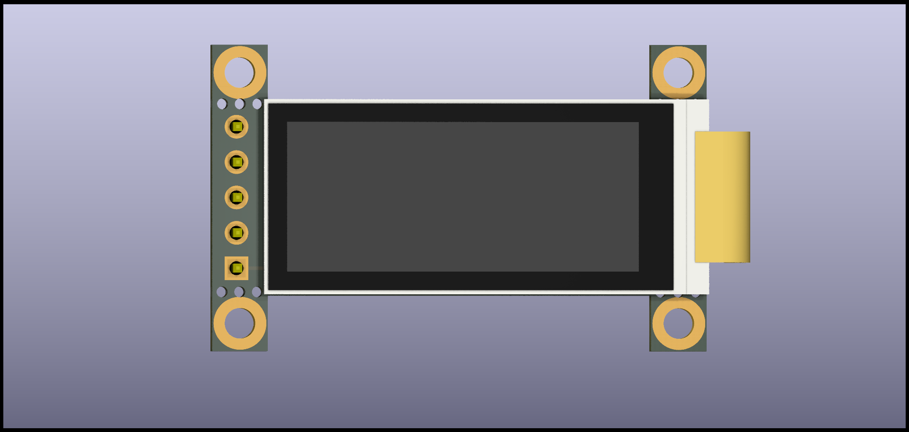
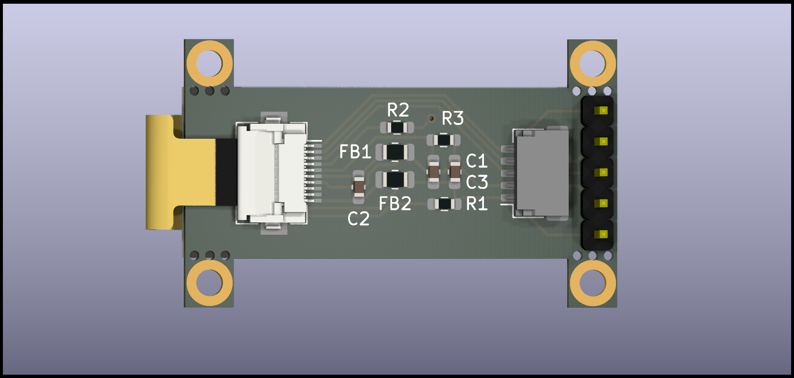
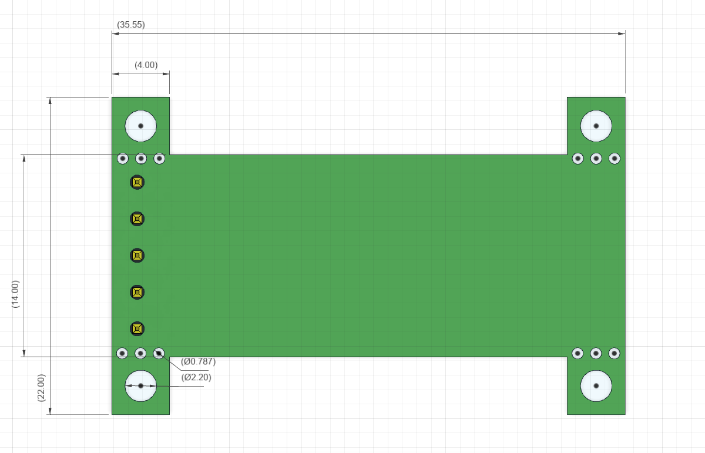

# LS011B7DH03 Sharp memory display breakout 1.1 inch 160x68 (3.3v only)
---
## Original version

## [Nice!view](https://nicekeyboards.com/nice-view) Compatible Pinout Version (With mounting holes) 
check [nice-compat](https://github.com/karnadii/sharp_memory_display_breakout/tree/niceview-compat) branch

## [Nice!view](https://nicekeyboards.com/nice-view) Compatible Pinout Version (NO mounting holes) 
check [nice-compat-no-mount](https://github.com/karnadii/sharp_memory_display_breakout/tree/niceview-compat) branch.

Since nice!view is released, in the future there will be more board designed for nice!view. so I redesign the pinout to be compatible with nice!view pinout, if in the future nice!view is run out of stock, mechkey folk will still have an alternative. DIY is sometimes more expensive, buy Nice!View instead of making this yourself https://nicekeyboards.com/nice-view

UPDATE: Nice!View Compat version is working, confirmed by some redditor, if your nice!view broken, you can replace it with this with the same config file as nice!view.

all of each version gerber, schematic and step files are here https://github.com/karnadii/sharp_memory_display_breakout/releases

---
I design it as small as possible with fewer component than the adafruit memory display using the datasheet and adafruit memory display as a guide. If you Mech Keyboards folk want to replace your i2c 128X32 OLED display, you just need to swap it and add bodge wire for the CLK pin to any available GPIO on your microcontroller. It is compatible with 128X32 OLED display pinout in mind.
here is a comparison between [nrfmicro](https://github.com/joric/nrfmicro) (promicro size) and 128x32 oled display.

I intent to use this breakout as soldered or socketed using pin header or as a daughterboard. if using as a daughter-board don't solder the pin header and solder the jst connector. if soldered/socketed just solder the pin header and leave the jst connector, you can break the mounting hole if you want to save some space,the mountung hole is intended for using it as a daughter-board.

### PCB Size

### BOM
| Name                | Qty | Value                              | Footprint | LCSC Part #                                           |
|---------------------|-----|------------------------------------|-----------|-------------------------------------------------------|
| C1                  | 1   | 560pF/680pF Unpolarized capacitor" | 0603      | C84721                                                |
| C2,C3               | 2   | 1uF Unpolarized capacitor          | 0603      | C15849                                                |
| FB1,FB2             | 2   | Ferrite Bead                       | 0805      | C1017                                                 |
| J2                  | 1   | FH12-10S-0.5SH FPC Connector       | -         | C506791                                               |
| J3                  | 1   | JST SH 5x1 (Optional)              | -         | https://www.aliexpress.com/item/1005003131441676.html |
| R1,R2,R3            | 3   | 10kΩ Resistor (optional)           | 0603      | C25804                                                |
| LS011B7DH03 Display | 1   |            -                       |  -        | https://aliexpress.com/item/1005001809102193.html     |

Unfortunately there is only one person who sell LS011B7DH03 on aliexpress. If someone have another source than aliexpress, please tell me through issue. Also one out of 3 display I receive is dead. If you don't want to gamble wether you receive a good display or not, just buy [nice!view](https://nicekeyboards.com/nice-view)

According to @Nicell the resistors is not required, you can remove all the resistor if you find it not needed. 
https://discord.com/channels/719497620560543766/1020985541598138388/1021185829491720302

everything is tested and work without problem.

### Price
5 PCBs with assembled component from JLPCB is $16 and 5 pcs [LS011B7DH03](https://www.aliexpress.com/item/1005001809102193.html) is $75 ($15x5), so for one LS011B7DH03 Sharp memory display it cost about **$18.2** before shipping.

I think you can get cheaper if you order the components from aliexpress and solder all the components yourself and order from JLPCB the PCB only without assembly, probably $10 for PCB and component, $5 20 pcs PCB and another $5 for the components.

I found cheaper one from  [alibaba](https://www.alibaba.com/product-detail/Sharp-LS011B7DH03-1-1-inch-mono_1600084470004.html?spm=a2700.galleryofferlist.normal_offer.d_image.5b7e535dIAtoXw), a piece cost about $5. but I never order from alibaba. Maybe they require bigger minimum order for cheaper LCD.

or this [one](https://www.alibaba.com/product-detail/HL-1-08-Inch-Square-Transflective_1600473084807.html?spm=a2700.galleryofferlist.normal_offer.d_image.5b7e535dIAtoXw) which is more cheaper but have different footprint for the socket, I believe this one intended to directly solder to PCB unlike this version that use socket for the display. 

someone says that the price from alibaba is a fake price, if you message them, they will give you higher price.

Someone from China tell me the price for one LS011B7DH03 or similar memory display in china is 63 CNY ($8.97). So if you can obtain them from china, you can get maybe **$12-$15** a piece for one working LS011B7DH03 breakout.

@nicell the maker of nice!nano released [nice!view](https://nicekeyboards.com/nice-view) for **$20** a piece.

Memory display is expensive, but with the battery saving feature of e-paper (~10μA power draw according to nicell) and high refresh rate 30hz, I think it is worth having it especially on one of your main wireless keyboards. At least have one for your main keyboard wether is DIY one like my breakout or nice!view.

<!-- 

 -->

### Demo

I have test it with circuitpython, arduino and Zhepyr (ZMK) with nrfmicro, the test code is in `test_code` folder.
#### arduino

https://user-images.githubusercontent.com/18657277/137644641-276d998f-445c-41ad-aaf1-b85f445b7fb1.mp4

#### circuitpython

https://user-images.githubusercontent.com/18657277/146429499-8556456f-ffeb-47a3-a99c-73e11da73714.mp4

#### ZMK
replacing my oled, need to bodge one wire, fortunately I have a lot of free gpio pins.

